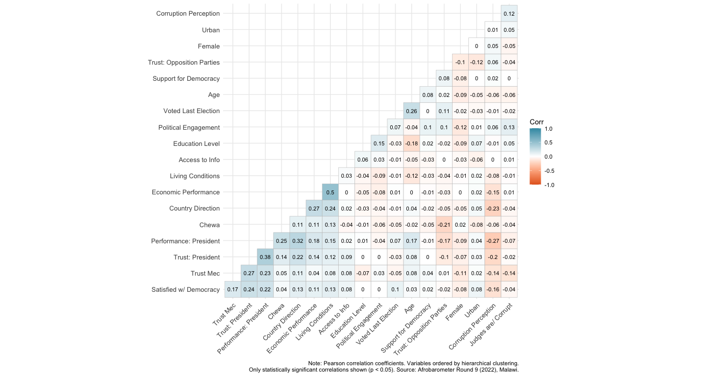
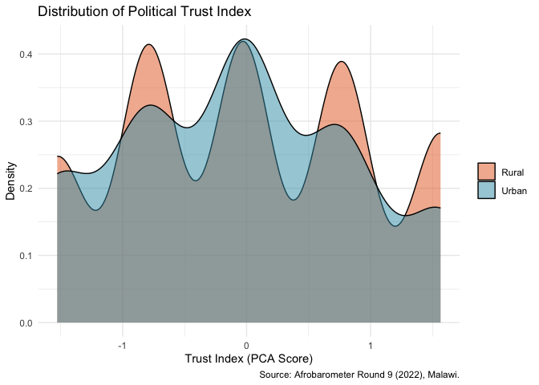
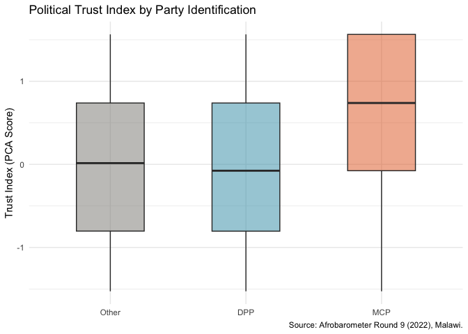
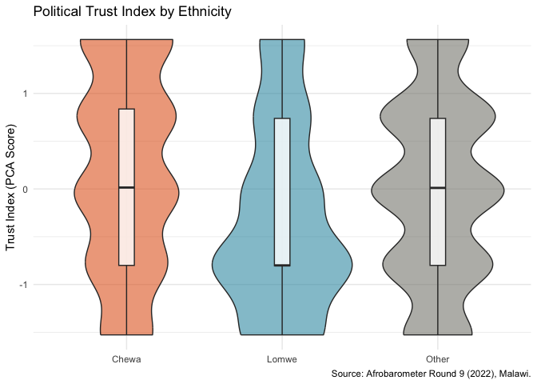
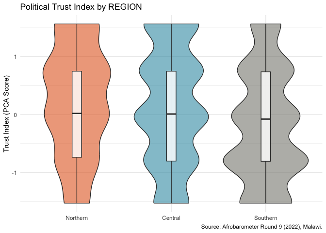
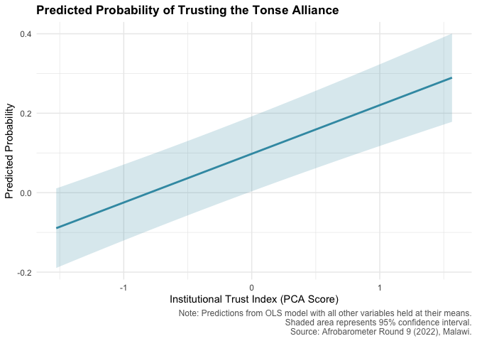
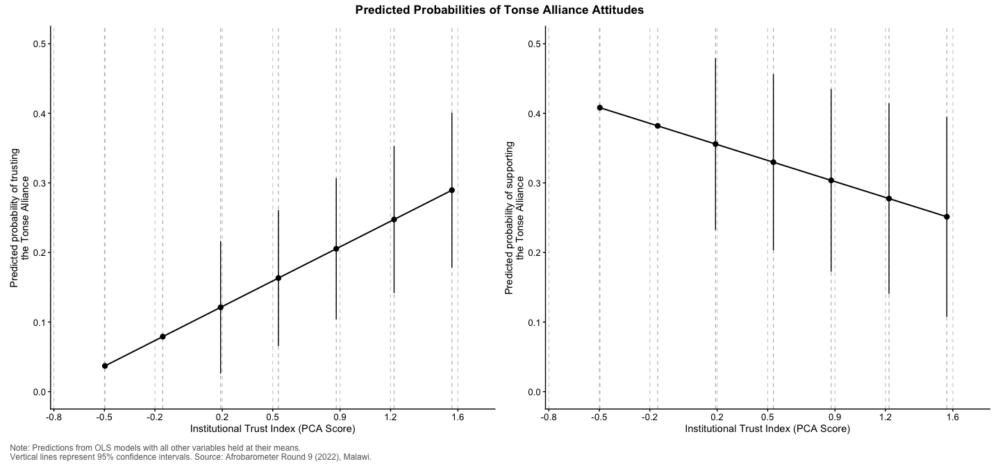

# EDA with Afrobarometer R9 (2022) Malawi
JT

### Libraries

``` r
library(tidyverse)
library(haven)
library(magrittr)
library(summarytools)
library(labelled)
library(sjlabelled)
library(ggcorrplot)
library(psych)
library(modelsummary)
library(fixest)
library(marginaleffects)
library(patchwork)
```

### Data

``` r
mlwr10 <- "https://www.afrobarometer.org/wp-content/uploads/2023/06/afrobarometer_release-dataset_mlw_r9_en_2023-03-01.sav" %>% 
  haven::read_sav() %>% 
  haven::as_factor() #straight from source --> AB website 
```

``` r
df <- mlwr10 %>% 
    mutate(
    sat_democracy = case_match(
      Q31,
      "Very satisfied" ~ 4, 
      "Fairly satisfied" ~ 3, 
      "Not very satisfied" ~ 2, 
      "Not at all satisfied" ~ 1, 
      .default = NA ),  # satisfied with democracy
    corruption_level = case_when(
      Q39A %in% c("Increased somewhat", "Increased a lot") ~ 1, 
      Q39A %in% c("Decreased a lot", "Decreased somewhat") ~ 0,
      TRUE ~ NA_real_), # levels of corruption -> increased 
    trust_courtlaw = case_when(
      Q37I %in% c("A lot", "Somewhat") ~ 1, 
      Q37I %in% c("Just a little", "Not at all") ~ 0, 
      TRUE ~ NA_real_), 
    corrupt_judges = case_when(
      Q38F %in% c("All of them", "Most of them", "Some of them") ~ 1, 
      Q38F == "None" ~ 0, 
      TRUE ~ NA_real_), # corrupt judges and magistrates 
    party_id = case_when(
      Q89B == "Democratic Progressive Party (DPP)" ~ "DPP",
      Q89B == "Malawi Congress Party (MCP)" ~ "MCP",
      Q89B %in% c("United Democratic Front (UDF)", 
                  "UTM", 
                  "People’s Party (PP)", 
                  "Alliance for Democracy (AFORD)",
                  "Malawi Forum for Unity and Development (MAFUNDE)",
                  "National Salvation Front (NSF)",
                  "New Rainbow Coalition Party (NARC)",
                  "People’s Democratic Movement (PDM)",
                  "People’s Progressive Movement (PPM)",
                  "People’s Transformation Party (PETRA)",
                  "Republican Party (RP)",
                  "New Labor Party (NLP)",
                  "Chipani Cha Fuko (CCP)",
                  "United Independent Party (UIP)",
                  "Mbakuwaku Movement for Democracy (MMD)",
                  "Other") ~ "Other",
      Q89B %in% c("Not Applicable", "Refused", "Don't know") ~ NA_character_,
      TRUE ~ NA_character_  ),
    party_id = factor(party_id, levels = c("Other", "DPP", "MCP")),
    performance_econ = case_when(
      Q4A %in% c("Fairly good", "Very good") ~1 ,
      Q4A %in% c("Fairly bad", "Very bad") ~0, 
      TRUE ~ NA_real_), # econ
    urban = case_when(
      URBRUR %in% c("Peri-urban", "Urban") ~ 1, 
      URBRUR == "Rural" ~0),
    age = as.double(as.character(Q1)), 
    voted_last_election = case_when(
      Q13 == "I voted in the election" ~ 1, 
      Q13 %in% c("I did not vot", "I was too young to vote") ~0, 
      TRUE ~ NA_real_),
    performance_president = case_when(
      Q47A %in% c("Approve", "Strongly approve") ~ 1, 
      Q47A %in% c("Strongly disapprove", "Disapprove") ~0,
      TRUE ~ NA_real_),
    sat_democracy_binary = case_when(
      sat_democracy %in% c(3, 4) ~ 1,  # Fairly or Very satisfied
      sat_democracy %in% c(1, 2) ~ 0,  # Not at all or Not very satisfied
      TRUE ~ NA_real_),
    trust_president = case_when(
      Q37A %in% c("Just a little", "Somewhat", "A lot") ~1, 
      Q37A %in% c("Not at all") ~ 0, 
      TRUE ~ NA_real_), 
    formal_education  = case_when(
      Q94 == "No formal schooling" ~ 0, 
      Q94 %in% c("Informal schooling only (including Koranic schooling)", "Some primary schooling", 
                 "Primary school completed", "Intermediate school or Some secondary school / high school", 
                 "Secondary school / high school completed", 
                 "Post-secondary qualifications, other than university e.g. a diploma or degree from a polytechnic or college", 
                 "Some university", "Post-graduate") ~1 , 
      TRUE ~ NA_real_), 
    living_condition = case_when(
      Q4B %in% c("Very bad", "Fairly bad") ~ 0,
      Q4B %in% c("Fairly good", "Very good") ~ 1,
      TRUE ~ NA_real_),
    support_democracy = case_when(
      Q23 == "STATEMENT 1: Democracy is preferable to any other kind of government." ~ 1,
      Q23 %in% c(
        "STATEMENT 2: In some circumstances, a non-democratic government can be preferable.",
        "STATEMENT 3: For someone like me, it doesn’t matter what kind of government we have."
      ) ~ 0,
      TRUE ~ NA_real_ ),  
    access_info = case_when(
      Q35B %in% c("Somewhat likely", "Very likely") ~ 1,
      Q35B %in% c("Not at all likely", "Not very likely", "Refused", "Don’t know/Haven’t heard") ~ 0,
      TRUE ~ NA_real_), 
        mcp_alone = case_match(
          Q82B_MLW,
          c("Strongly disagree", "Disagree") ~ 0,
          c("Strongly agree", "Agree") ~ 1,
          c("Don’t know", "Refused to answer", "Neither agree nor disagree") ~ NA_real_,
          .default = NA_real_
        ),
        utm_alone = case_match(
          Q82C_MLW,
          c("Strongly disagree", "Disagree") ~ 0,
          c("Strongly agree", "Agree") ~ 1,
          c("Don’t know", "Refused to answer","Neither agree nor disagree") ~ NA_real_,
          .default = NA_real_
        ),
        support_alliance = case_when(
          mcp_alone == 1 | utm_alone == 1 ~ 0,
          mcp_alone == 0 & utm_alone == 0 ~ 1,
          TRUE ~ NA_real_
        ),
    direction_country = case_match(
      Q3,
      "Going in the right direction" ~ 1,
      "Going in the wrong direction" ~ 0,
      .default = NA_real_),
    trust_tonse = case_match(
      Q37E,
      c("Somewhat", "A lot") ~ 1,
      c("Not at all", "Just a little") ~ 0,
      c("Refused", "Don’t know/Haven’t heard enough to say") ~ NA_real_), 
    support_many_parties = case_when(
      Q25 %in% c("Agree with 2", "Agree very strongly with 2") ~ 1,
      Q25 %in% c("Agree with 1", "Agree very strongly with 1") ~ 0,
      TRUE ~ NA_real_), 
    female = case_when(
      Q101 == "Woman" ~ 1,
      Q101 == "Man" ~ 0,
      TRUE ~ NA_real_),
    Chewa = case_when(
      Q84A == "Chewa" ~ 1,
      Q84A != "Chewa" ~ 0,
      TRUE ~ NA_real_
    ),
    Lomwe = case_when(
      Q84A == "Lomwe" ~ 1,
      Q84A != "Lomwe" ~ 0,
      TRUE ~ NA_real_
    ),
    other_tribes = case_when(
      Q84A %in% c("Chewa", "Lomwe") ~ 0,
      !Q84A %in% c("Chewa", "Lomwe") ~ 1,
      TRUE ~ NA_real_), 
    decision_couple = case_when(
      Q93C == "You make the decisions jointly with your spouse" ~ 1,
      Q93C == "Not applicable, no earnings" ~ NA_real_, 
      TRUE ~ 0), 
    political_engage = case_match(
      Q8,
      c("Occasionally", "Frequently") ~ 1,
      "Never" ~ 0,
      .default = NA_real_),
    trust_opp_parties = case_match(
      Q37F,
      c("Somewhat", "A lot") ~ 1,
      c("Not at all", "Just a little") ~ 0,
      .default = NA_real_), 
    trust_parliament = case_match(
      Q37B,
      c("Somewhat", "A lot") ~ 1,
      c("Not at all", "Just a little") ~ 0,
      .default = NA_real_), 
    trust_mec = case_match(
      Q37C,
      c("Somewhat", "A lot") ~ 1,
      c("Not at all", "Just a little") ~ 0,
      .default = NA_real_)
  )


### labels 
clean_labels <- c(
  trust_president        = "Trust: President",
  performance_president  = "Performance: President",
  performance_econ       = "Economic Performance",
  direction_country      = "Country Direction",
  living_condition       = "Living Conditions",
  sat_democracy_binary   = "Satisfied w/ Democracy",
  voted_last_election    = "Voted Last Election",
  support_democracy      = "Support for Democracy",
  formal_education       = "Education Level",
  age                    = "Age",
  urban                  = "Urban",
  female                 = "Female",
  Chewa                  = "Chewa",
  corruption_level       = "Corruption Perception",
  political_engage       = "Political Engagement",
  trust_opp_parties      = "Trust: Opposition Parties",
  trust_mec              =  "Trust Mec", 
  access_info             = "Access to Info", 
  corrupt_judges         ="Judges are/ Corrupt"
)
```

### Variable Correlation

``` r
rename_vec <- setNames(names(clean_labels), clean_labels)

vars_corrplot <- df %>%
  dplyr::select(all_of(names(clean_labels))) %>%
  mutate(across(everything(), as.numeric)) %>%
  rename(!!!rename_vec) %>%
  cor(use = "pairwise.complete.obs") %>%
  ggcorrplot(
    hc.order = TRUE,
    type     = "lower",
    lab      = TRUE,
    lab_size = 3,
    tl.cex = 10,
    colors   = c("#E46726", "white", "#3B9AB2")
  ) + 
  labs(
    caption = "Note: Pearson correlation coefficients. Variables ordered by hierarchical clustering.\nOnly statistically significant correlations shown (p < 0.05). Source: Afrobarometer Round 9 (2022), Malawi."
  )

  vars_corrplot
```



### Trust Index

``` r
# trust vars 
trust_vars <- df %>%
  dplyr::select(
    trust_president,
    trust_mec,
    trust_parliament,
    trust_courtlaw
  ) %>%
  mutate(across(everything(), as.numeric))

# PCA
trust_pca <- psych::principal(trust_vars, 
                               nfactors = 1, 
                               rotate = "none",
                               missing = TRUE)


df$trust_index <- trust_pca$scores[, 1] #extract scores and add to df
 psych::alpha(trust_vars, na.rm = TRUE, check.keys = TRUE) #Cranbach's alpha
```


    Reliability analysis   
    Call: psych::alpha(x = trust_vars, na.rm = TRUE, check.keys = TRUE)

      raw_alpha std.alpha G6(smc) average_r S/N   ase mean   sd median_r
          0.59      0.59    0.52      0.26 1.4 0.019 0.51 0.33     0.28

        95% confidence boundaries 
             lower alpha upper
    Feldt     0.55  0.59  0.63
    Duhachek  0.55  0.59  0.63

     Reliability if an item is dropped:
                     raw_alpha std.alpha G6(smc) average_r  S/N alpha se   var.r
    trust_president       0.54      0.54    0.44      0.28 1.19    0.023 0.00118
    trust_mec             0.48      0.48    0.38      0.23 0.92    0.026 0.00290
    trust_parliament      0.50      0.50    0.40      0.25 0.99    0.025 0.00403
    trust_courtlaw        0.55      0.55    0.45      0.29 1.21    0.023 0.00038
                     med.r
    trust_president   0.30
    trust_mec         0.24
    trust_parliament  0.27
    trust_courtlaw    0.28

     Item statistics 
                        n raw.r std.r r.cor r.drop mean   sd
    trust_president  1176  0.65  0.65  0.44   0.34 0.60 0.49
    trust_mec        1154  0.71  0.70  0.55   0.42 0.43 0.50
    trust_parliament 1162  0.68  0.69  0.51   0.40 0.34 0.47
    trust_courtlaw   1169  0.64  0.64  0.43   0.33 0.64 0.48

    Non missing response frequency for each item
                        0    1 miss
    trust_president  0.40 0.60 0.02
    trust_mec        0.57 0.43 0.04
    trust_parliament 0.66 0.34 0.03
    trust_courtlaw   0.36 0.64 0.03

### Plot

``` r
# By urban/rural
df %>%
  filter(!is.na(trust_index), !is.na(urban)) %>%
  mutate(urban = factor(urban, labels = c("Rural", "Urban"))) %>%
  ggplot(aes(x = trust_index, fill = urban)) +
  geom_density(alpha = 0.5) +
  scale_fill_manual(values = c("#E46726", "#3B9AB2")) +
  labs(
    title = "Distribution of Political Trust Index",
    x = "Trust Index (PCA Score)",
    y = "Density",
    fill = NULL,
    caption = "Source: Afrobarometer Round 9 (2022), Malawi."
  ) +
  theme_minimal()
```



``` r
# By party ID
df %>%
  filter(!is.na(trust_index), !is.na(party_id)) %>%
  ggplot(aes(x = party_id, y = trust_index, fill = party_id)) +
  geom_boxplot(alpha = 0.5, width = .5) +
  scale_fill_manual(values = c("#888780", "#3B9AB2", "#E46726")) +
  labs(
    title = "Political Trust Index by Party Identification",
    x = NULL,
    y = "Trust Index (PCA Score)",
    fill = NULL,
    caption = "Source: Afrobarometer Round 9 (2022), Malawi."
  ) +
  theme_minimal() +
  theme(legend.position = "none")
```



``` r
# By ethnicity
df %>%
  filter(!is.na(trust_index)) %>%
  mutate(ethnicity = case_when(
    Chewa == 1 ~ "Chewa",
    Lomwe == 1 ~ "Lomwe",
    TRUE ~ "Other"
  )) %>%
  ggplot(aes(x = ethnicity, y = trust_index, fill = ethnicity)) +
  geom_violin(alpha = 0.6) +
  geom_boxplot(width = 0.1, fill = "white", alpha = 0.8) +
  scale_fill_manual(values = c("#E46726","#3B9AB2", "#888780")) +
  labs(
    title = "Political Trust Index by Ethnicity",
    x = NULL,
    y = "Trust Index (PCA Score)",
    caption = "Source: Afrobarometer Round 9 (2022), Malawi."
  ) +
  theme_minimal() +
  theme(legend.position = "none")
```



``` r
## REGION
df %>%
  filter(!is.na(trust_index)) %>%
  ggplot(aes(x = REGION, y = trust_index, fill = REGION)) +
  geom_violin(alpha = 0.6) +
  geom_boxplot(width = 0.1, fill = "white", alpha = 0.8) +
  scale_fill_manual(values = c("#E46726","#3B9AB2", "#888780")) +
  labs(
    title = "Political Trust Index by REGION",
    x = NULL,
    y = "Trust Index (PCA Score)",
    caption = "Source: Afrobarometer Round 9 (2022), Malawi."
  ) +
  theme_minimal() +
  theme(legend.position = "none")
```



``` r
mod1 <- feols(trust_tonse ~ trust_index +
              performance_econ +
              direction_country +
              living_condition +
              sat_democracy_binary +
              voted_last_election +
              support_democracy +
              political_engage +
              trust_opp_parties +
              access_info +
              urban +
              formal_education +
              female +
              age +
              Chewa +
              REGION,
              data = df)

mod2 <- feols(support_alliance ~ trust_index +
              performance_econ +
              direction_country +
              living_condition +
              sat_democracy_binary +
              voted_last_election +
              support_democracy +
              political_engage +
              trust_opp_parties +
              access_info +
              urban +
              formal_education +
              female +
              age +
              Chewa +
              REGION,
              data = df) #not complete --> cluster by EA and Enumerator FE missing 

# modelsummary(
#   list("Trust Tonse" = mod1, "Support Tonse" = mod2),
#   statistic = "({std.error})",
#   coef_omit = "Intercept",
#   stars = c("*" = 0.1, "**" = 0.05, "***" = 0.01),
#   output = "html"
# )
```

#### Trust Tonse Alliance

``` r
# Extract predicted values across the range of trust_index
pred <- predictions(mod1, 
                    newdata = datagrid(
                      trust_index = seq(min(df$trust_index, na.rm = TRUE),
                                       max(df$trust_index, na.rm = TRUE),
                                       length.out = 100)
                    ))

# Plot
ggplot(pred, aes(x = trust_index, y = estimate)) +
  geom_line(color = "#3B9AB2", linewidth = 1) +
  geom_ribbon(aes(ymin = conf.low, ymax = conf.high), 
              fill = "#3B9AB2", alpha = 0.2) +
  labs(
    title = "Predicted Probability of Trusting the Tonse Alliance",
    x = "Institutional Trust Index (PCA Score)",
    y = "Predicted Probability",
    caption = "Note: Predictions from OLS model with all other variables held at their means.\nShaded area represents 95% confidence interval.\nSource: Afrobarometer Round 9 (2022), Malawi."
  ) +
  theme_minimal() +
  theme(
    plot.title    = element_text(size = 13, face = "bold"),
    plot.subtitle = element_text(size = 11, color = "gray40"),
    plot.caption  = element_text(size = 9, color = "gray40"),
    axis.title    = element_text(size = 11)
  )
```



``` r
pred <- predictions(mod1,
                    newdata = datagrid(
                      trust_index = seq(min(df$trust_index, na.rm = TRUE),
                                       max(df$trust_index, na.rm = TRUE),
                                       length.out = 10)
                    ))

plot_trust <-  ggplot(pred, aes(x = trust_index, y = estimate)) +
  geom_vline(xintercept = seq(min(df$trust_index, na.rm = TRUE),
                               max(df$trust_index, na.rm = TRUE),
                               length.out = 10),
             linetype = "dashed", color = "gray70", linewidth = 0.4) +
  geom_line(linewidth = 0.7, color = "black") +
  geom_pointrange(aes(ymin = conf.low, ymax = conf.high),
                  size = 0.4, color = "black") +
  scale_y_continuous(limits = c(0, 0.5),          # constrain y-axis
                     breaks = seq(0, 0.5, by = 0.1)) +
  scale_x_continuous(limits = c(-0.7, 1.7),        # trim empty left space
                     breaks = round(seq(min(df$trust_index, na.rm = TRUE),
                                       max(df$trust_index, na.rm = TRUE),
                                       length.out = 10), 1)) +
  labs(
    x = "Institutional Trust Index (PCA Score)",
    y = "Predicted probability of trusting\nthe Tonse Alliance"
  ) +
  theme_classic() +
  theme(
    axis.title      = element_text(size = 11),
    axis.text       = element_text(size = 10),
    plot.caption    = element_text(size = 9, color = "gray40"),   # left align caption
    panel.grid.major.x = element_line(color = "gray80",
                                       linetype = "dashed",
                                       linewidth = 0.4)
  )
```

#### Support for Tonse

``` r
pred_support <- predictions(mod2,
                    newdata = datagrid(
                      trust_index = seq(min(df$trust_index, na.rm = TRUE),
                                       max(df$trust_index, na.rm = TRUE),
                                       length.out = 10)
                    ))

plot_support <- ggplot(pred_support, aes(x = trust_index, y = estimate)) +
  geom_vline(xintercept = seq(min(df$trust_index, na.rm = TRUE),
                               max(df$trust_index, na.rm = TRUE),
                               length.out = 10),
             linetype = "dashed", color = "gray70", linewidth = 0.4) +
  geom_line(linewidth = 0.7, color = "black") +
  geom_pointrange(aes(ymin = conf.low, ymax = conf.high),
                  size = 0.4, color = "black") +
  scale_y_continuous(limits = c(0, 0.5),
                     breaks = seq(0, 0.5, by = 0.1)) +
  scale_x_continuous(limits = c(-0.7, 1.7),
                     breaks = round(seq(min(df$trust_index, na.rm = TRUE),
                                       max(df$trust_index, na.rm = TRUE),
                                       length.out = 10), 1)) +
  labs(
    x = "Institutional Trust Index (PCA Score)",
    y = "Predicted probability of supporting\nthe Tonse Alliance"
  ) +
  theme_classic() +
  theme(
    axis.title      = element_text(size = 11),
    axis.text       = element_text(size = 10),
    plot.caption    = element_text(size = 9, color = "gray40"),
    panel.grid.major.x = element_line(color = "gray80",
                                       linetype = "dashed",
                                       linewidth = 0.4)
  )
```

``` r
combined_plot <- (plot_trust | plot_support) +
  plot_annotation(
    title   = "Predicted Probabilities of Tonse Alliance Attitudes",
    caption = "Note: Predictions from OLS models with all other variables held at their means.\nVertical lines represent 95% confidence intervals. Source: Afrobarometer Round 9 (2022), Malawi.",
    theme   = theme(
      plot.title   = element_text(size = 13, face = "bold", hjust = 0.5),
      plot.caption = element_text(size = 9, color = "gray40", hjust = 0)
    )
  )

combined_plot
```


